# Chương 3. Phân tích và thiết kế hệ thống

Chương này mô tả FwdFlow ở mức thiết kế: các tác nhân và yêu cầu (mục 3.1), kiến trúc và cách triển khai (3.2), mô hình dữ liệu (3.3), các máy trạng thái điều khiển vòng đời lô hàng (3.4), cách tính free time DEM/DET (3.5), thiết kế ba tính năng AI (3.6), các biện pháp bảo mật (3.7) và giao diện (3.8). Mọi mô tả trong chương đều bám theo mã nguồn hiện có của hệ thống; các hằng số (ngưỡng, giới hạn, thời gian chờ) là giá trị đang được dùng trong mã, không phải giá trị dự kiến.

## 3.1 Tác nhân và yêu cầu

### 3.1.1 Tác nhân

Hệ thống phục vụ một forwarder vừa và nhỏ làm dịch vụ nhập khẩu trọn gói (door-to-door). Có sáu vai trò đăng nhập, mỗi tài khoản đúng một vai trò, cộng thêm một tác nhân không đăng nhập là người nhận hàng (bảng 3.1). Tên kỹ thuật của vai trò là giá trị của kiểu liệt kê `Role` trong mã nguồn; bốn vai trò đầu là nhân viên nội bộ.

*Bảng 3.1. Tác nhân của hệ thống*

| Tác nhân | Mã vai trò | Việc chính |
| --- | --- | --- |
| Quản trị viên | `ADMIN` | Quản lý người dùng, xem nhật ký thao tác, làm được mọi việc của các vai trò nội bộ khác |
| Nhân viên chứng từ | `DOCS` | Tạo lô, nhập chứng từ, duyệt kết quả AI đọc chứng từ, khai mã HS, theo dõi free time, chuyển trạng thái lô tới khi thông quan |
| Điều độ viên | `DISPATCH` | Lập lệnh xe lấy container và trả vỏ, tách đơn giao nội địa, phân công tài xế, xử lý đơn giao thất bại, đóng lô |
| Kế toán | `ACCOUNTANT` | Nhập thu chi, xem báo cáo DEM/DET và lợi nhuận, hỏi trợ lý về dữ liệu tài chính |
| Khách hàng | `CUSTOMER` | Xem lô của chính mình trên cổng khách hàng, tải chứng từ được phép, nhận email nhắc hạn free time |
| Tài xế | `DRIVER` | Nhận lệnh xe và đơn giao trên điện thoại, bấm trạng thái kèm ảnh, tên người ký, lý do |
| Người nhận hàng | (không đăng nhập) | Tra cứu trạng thái đơn giao bằng mã vận đơn 10 ký tự |

### 3.1.2 Ba luồng giao hàng

Mỗi lô hàng có loại hàng (`FCL` nguyên container hoặc `LCL` hàng lẻ) và kiểu giao (`delivery_mode`). Tổ hợp hợp lệ tạo ra ba luồng nghiệp vụ:

- **FCL giao qua kho** (`VIA_WAREHOUSE`): container được kéo từ cảng về kho của công ty, rút hàng, rồi tách thành nhiều đơn giao nội địa tới từng người nhận; vỏ container trả về depot. Đây là luồng đầy đủ nhất và là luồng được kiểm thử đầu-cuối.
- **FCL giao thẳng tới cửa** (`CONTAINER_TO_DOOR`): container kéo thẳng tới kho của khách, người nhận ký; không có đơn giao nội địa; vỏ trả về depot sau khi khách rút hàng.
- **LCL giao qua kho**: hàng lẻ không có container riêng, Điều độ xác nhận đã nhận hàng từ kho CFS (kèm ảnh phiếu xuất kho), sau đó tách đơn giao như luồng đầu. LCL chỉ được phép kiểu giao qua kho; tổ hợp LCL với giao thẳng tới cửa bị từ chối ngay khi tạo lô.

### 3.1.3 Bảng quyền

Quyền được khai báo ở một nơi duy nhất là bảng `PERMISSIONS` (file `api/app/auth/permissions.py`), ánh xạ mỗi hành động (action) tới tập vai trò được phép. Mọi endpoint của API gắn đúng một hành động; bộ kiểm thử sinh tự động ma trận vai trò × endpoint từ bảng này (chương 4). Bảng 3.2 chép nguyên 26 hành động của bảng đó.

*Bảng 3.2. Bảng quyền theo vai trò (✓ = được phép)*

| Hành động | Ý nghĩa | ADMIN | DOCS | DISPATCH | ACCOUNTANT | CUSTOMER | DRIVER |
| --- | --- | :-: | :-: | :-: | :-: | :-: | :-: |
| `shipment.read` | Xem lô hàng, container, dòng hàng, tờ khai | ✓ | ✓ | ✓ | ✓ | | |
| `shipment.write` | Tạo, sửa, chuyển trạng thái, huỷ lô | ✓ | ✓ | | | | |
| `container.milestone` | Ghi mốc container (dỡ, ra cổng, trả vỏ) | ✓ | ✓ | | | | |
| `document.read` | Xem và tải chứng từ | ✓ | ✓ | ✓ | ✓ | | |
| `document.write` | Tải lên, thay thế chứng từ | ✓ | ✓ | | | | |
| `freetime.read` | Xem bảng free time | ✓ | ✓ | ✓ | ✓ | | |
| `freetime.write` | Quy tắc free time, bậc phí, override theo lô | ✓ | ✓ | | | | |
| `transport.read` | Xem lệnh xe, đơn giao | ✓ | ✓ | ✓ | ✓ | | |
| `transport.write` | Lệnh xe, đơn giao, xác nhận LCL, đóng lô | ✓ | | ✓ | | | |
| `transport.void_event` | Huỷ một event vận chuyển | ✓ | | ✓ | | | |
| `container.retime_event` | Chỉnh giờ event (ảnh hưởng free time) | ✓ | ✓ | | | | |
| `finance.read` | Xem thu chi, báo cáo | ✓ | | | ✓ | | |
| `finance.write` | Nhập thu chi | ✓ | | | ✓ | | |
| `catalog.read` | Xem danh mục | ✓ | ✓ | ✓ | ✓ | | |
| `catalog.commercial.write` | Sửa khách hàng, hãng tàu, cảng | ✓ | ✓ | | | | |
| `catalog.transport.write` | Sửa nhà xe, xe, tài xế, kho | ✓ | | ✓ | | | |
| `users.manage` | Tạo, khoá, đổi vai trò, đặt lại mật khẩu | ✓ | | | | | |
| `audit.read` | Xem nhật ký thao tác | ✓ | | | | | |
| `dashboard.read` | Xem dashboard vận hành | ✓ | ✓ | ✓ | ✓ | | |
| `dashboard.finance` | Xem số doanh thu, lợi nhuận trên dashboard | ✓ | | | ✓ | | |
| `extraction.review` | Duyệt, từ chối, thử lại kết quả AI đọc chứng từ | ✓ | ✓ | | | | |
| `hs.suggest` | Gọi gợi ý mã HS | ✓ | ✓ | | | | |
| `assistant.ask` | Hỏi trợ lý dữ liệu | ✓ | ✓ | ✓ | ✓ | | |
| `assistant.finance_views` | Trợ lý được thấy view tài chính | ✓ | | | ✓ | | |
| `portal.read` | Cổng khách hàng | | | | | ✓ | |
| `driver.act` | Thao tác của tài xế | | | | | | ✓ |

Bảng quyền chỉ là lớp thứ nhất. Lớp thứ hai là lọc theo dòng dữ liệu (mục 3.7): khách hàng chỉ thấy lô có `customer_id` của mình, tài xế chỉ thấy lệnh xe và đơn giao gán cho mình; bản ghi của người khác trả về 404 giống hệt bản ghi không tồn tại.

### 3.1.4 Yêu cầu phi chức năng

- Mọi mốc nghiệp vụ phải truy vết được: ai ghi, lúc nào, sửa lại ra sao; không được xoá hay ghi đè lịch sử.
- AI chỉ đề xuất; dữ liệu nghiệp vụ chỉ thay đổi khi người dùng duyệt, kèm dấu vết nguồn.
- Ứng dụng tài xế dùng được khi mạng chập chờn: thao tác được lưu trên máy và gửi lại; server phải bỏ qua thao tác gửi trùng.
- Dữ liệu gửi ra dịch vụ LLM bên ngoài phải được cảnh báo rõ trên giao diện, có cờ tắt toàn bộ AI mà nghiệp vụ nhập tay vẫn chạy.
- Chạy được trên một máy chủ nhỏ: một Postgres, một tiến trình API, một tiến trình worker, không cần hàng đợi hay bộ nhớ đệm ngoài.

## 3.2 Kiến trúc và triển khai

### 3.2.1 Tổng thể

Hệ thống gồm ba tầng và một cổng vào duy nhất (hình 3.1). Caddy là điểm tiếp nhận mọi kết nối: đường dẫn `/api/*` được chuyển tới API FastAPI, còn lại tới ứng dụng web Next.js. Vì web và API cùng một origin nên không cần CORS, cookie phiên dùng được trực tiếp, và file tải lên đi thẳng tới API mà không qua Next.js. Caddy cũng là nơi đặt các header bảo mật và Content-Security-Policy.

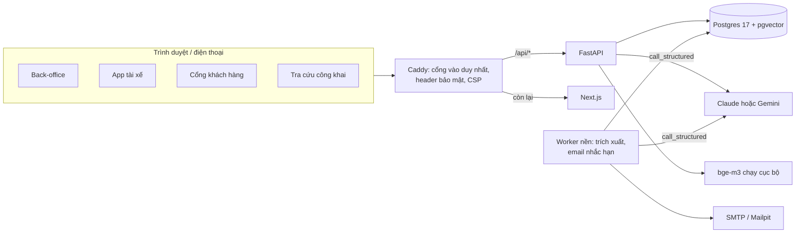
```mermaid
flowchart LR
    subgraph client[Trình duyệt / điện thoại]
        BO[Back-office]
        DRV[App tài xế]
        POR[Cổng khách hàng]
        TRK[Tra cứu công khai]
    end
    client --> CADDY[Caddy: cổng vào duy nhất,<br/>header bảo mật, CSP]
    CADDY -->|/api/*| API[FastAPI]
    CADDY -->|còn lại| WEB[Next.js]
    API --> DB[(Postgres 17 + pgvector)]
    WORKER[Worker nền: trích xuất,<br/>email nhắc hạn] --> DB
    API -->|call_structured| LLM[Claude hoặc Gemini]
    WORKER -->|call_structured| LLM
    API --> EMB[bge-m3 chạy cục bộ]
    WORKER --> SMTP[SMTP / Mailpit]
```

*Hình 3.1. Kiến trúc tổng thể của FwdFlow*

- **Web (Next.js, App Router)** có bốn bề mặt: back-office cho nhân viên, ứng dụng tài xế dạng web responsive cài được lên màn hình chính (manifest), cổng khách hàng, và trang tra cứu công khai. Web gọi API cùng origin và không dùng cơ chế `rewrites` của Next.js; trang tra cứu không dựng sẵn dữ liệu ở phía server để HTML không chứa thông tin vận đơn.
- **API (FastAPI, Python 3.12)** chia module theo nghiệp vụ: `auth`, `catalog`, `shipments`, `documents`, `freetime`, `trucking`, `lastmile`, `driver`, `finance`, `reports`, `notifications`, `audit` và `ai` (gồm `extraction`, `hs`, `nlq`). Mỗi module có `router` (endpoint), `service` (nghiệp vụ) và `models` (ánh xạ bảng). Mọi phản hồi dùng một khuôn `{success, data, error, meta}`; lỗi nghiệp vụ mang mã `error.code` dạng `SNAKE_UPPER` để giao diện hiển thị đúng thông điệp.
- **Worker nền** là một tiến trình Python dùng chung mã nguồn với API, không dùng Redis hay Celery. Worker lấy việc trích xuất chứng từ ở trạng thái `PENDING` bằng `SELECT … FOR UPDATE SKIP LOCKED`, gọi LLM, và gửi email nhắc hạn free time mỗi sáng.
- **Postgres 17 + pgvector** là nguồn dữ liệu chuẩn duy nhất. File chứng từ nằm trên đĩa theo tên là mã băm SHA-256; cơ sở dữ liệu giữ metadata. Free time được tính bằng một hàm SQL dùng chung (mục 3.5); các view trong schema `nlq` là mặt cắt đã che thông tin cá nhân cho trợ lý hỏi đáp.
- **Tầng AI** đi qua một hàm duy nhất `call_structured`, nhận prompt, ảnh và lược đồ Pydantic, trả về JSON đã kiểm; nhà cung cấp chọn bằng biến `LLM_PROVIDER` (Claude mặc định, hoặc Gemini với gói miễn phí). Hàm này ghi lại cấu hình, số token, lý do dừng và độ trễ cho mỗi lần gọi; có ba chế độ `live` / `record` / `replay`, trong đó `replay` phát lại kết quả đã ghi để bộ kiểm thử chạy không tốn chi phí và không cần khoá API. Mô hình embedding bge-m3 chạy cục bộ trong tiến trình API để mã hoá câu truy vấn HS.

### 3.2.2 Triển khai

Hạ tầng phát triển chạy bằng `docker compose` với ba dịch vụ: `db` (ảnh `pgvector/pgvector:0.8.1-pg17`), `mailpit` (hộp thư giả để xem email nhắc hạn) và `caddy`. Mọi cổng chỉ gắn vào `127.0.0.1`; Caddy nghe ở `8088` và trỏ về API (`8000`) và web (`3000`) đang chạy trực tiếp trên máy phát triển qua `host.docker.internal`. Cách bố trí này khiến môi trường phát triển đi qua cùng cổng vào, cùng header và cùng CSP như khi triển khai thật, chỉ khác ở chỗ CSP cho phép `'unsafe-eval'` vì trình biên dịch của Next.js ở chế độ dev cần nó.

Cấu hình triển khai thật được thiết kế như sau và là bước còn lại của kế hoạch (chưa nằm trong mã nguồn hiện tại): `api`, `worker` và `web` được đóng gói thành ảnh container; `caddy` là dịch vụ duy nhất mở cổng 80/443 và tự lấy chứng chỉ HTTPS theo tên miền; `api` chạy `alembic upgrade head` trước khi nhận yêu cầu và dừng nếu migration lỗi; giao diện Mailpit đặt sau xác thực cơ bản; thư mục file và volume của Postgres được gắn ngoài container. HTTPS là bắt buộc vì ứng dụng tài xế dùng camera và vị trí, những API mà trình duyệt chỉ cấp trên kết nối an toàn.

Cơ sở dữ liệu được quản lý bằng Alembic với mười hai migration đánh số từ `0001_core` tới `0012_nlq`; bộ kiểm thử chạy trên một cơ sở dữ liệu Postgres thật (`fwdflow_test`) chứ không giả lập, mỗi ca kiểm thử chạy trong một savepoint và được cuộn lại.

## 3.3 Mô hình dữ liệu

### 3.3.1 Nguyên tắc

Ba nguyên tắc chi phối toàn bộ lược đồ:

1. **Postgres là nguồn chuẩn duy nhất.** File nằm trên đĩa theo SHA-256, cơ sở dữ liệu giữ metadata (loại, kiểu file đã xác minh, số trang, người tải).
2. **Mốc nghiệp vụ là event chỉ ghi thêm (append-only).** Mỗi bảng `*_events` có trigger `forbid_mutation` chặn `UPDATE` và `DELETE`. Mỗi event có `kind`, `occurred_at` (thời điểm nghiệp vụ), `recorded_at` (giờ server lúc ghi), `actor_id` và `reason`. Sửa sai không phải là sửa dòng cũ mà là ghi thêm event điều chỉnh: `RETIME` (ghi `occurred_at` mới cho một event, qua cột `adjusts_event_id`) hoặc `VOID` (huỷ hiệu lực một event). Hàm `effective_events` suy ra tập event còn hiệu lực bằng cách bỏ mọi event bị `VOID` và áp `RETIME` mới nhất theo `recorded_at`; view `effective_container_milestones` làm việc tương tự trong SQL để hàm tính free time dùng chung.
3. **Cột trạng thái chỉ là bộ nhớ đệm.** Cột `status` của lô, lệnh xe, đơn giao luôn dựng lại được từ event; nó tồn tại để lọc và hiển thị nhanh.

Tiền lưu dưới dạng số nguyên theo đơn vị nhỏ nhất kèm mã tiền tệ (VND nguyên đồng, USD theo cent); thời gian lưu `timestamptz` theo UTC; mọi quy tắc theo ngày (free time, email nhắc hạn, ngày giao dự kiến) dùng ngày lịch múi giờ `Asia/Ho_Chi_Minh`.

### 3.3.2 Nhóm nghiệp vụ

Hình 3.2 trình bày các thực thể nghiệp vụ và quan hệ chính; khoá ngoại tới `users` (người tạo, người phụ trách) lược bớt cho dễ đọc.

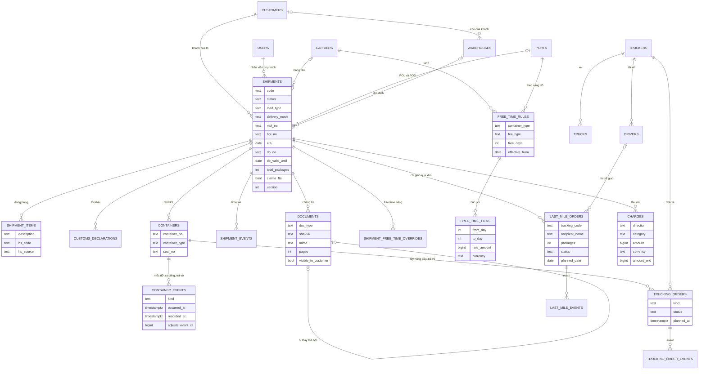
```mermaid
erDiagram
    CUSTOMERS ||--o{ SHIPMENTS : "khách của lô"
    USERS ||--o{ SHIPMENTS : "nhân viên phụ trách"
    CARRIERS o|--o{ SHIPMENTS : "hãng tàu"
    PORTS o|--o{ SHIPMENTS : "POL và POD"
    WAREHOUSES o|--o{ SHIPMENTS : "kho đích"
    CUSTOMERS o|--o{ WAREHOUSES : "kho của khách"
    SHIPMENTS ||--o{ SHIPMENT_ITEMS : "dòng hàng"
    SHIPMENTS ||--o{ CUSTOMS_DECLARATIONS : "tờ khai"
    SHIPMENTS ||--o{ CONTAINERS : "chỉ FCL"
    SHIPMENTS ||--o{ SHIPMENT_EVENTS : "timeline"
    CONTAINERS ||--o{ CONTAINER_EVENTS : "mốc dỡ, ra cổng, trả vỏ"
    SHIPMENTS ||--o{ DOCUMENTS : "chứng từ"
    DOCUMENTS o|--o| DOCUMENTS : "bị thay thế bởi"
    SHIPMENTS ||--o{ SHIPMENT_FREE_TIME_OVERRIDES : "free time riêng"
    CARRIERS ||--o{ FREE_TIME_RULES : "tariff"
    PORTS ||--o{ FREE_TIME_RULES : "theo cảng dỡ"
    FREE_TIME_RULES ||--o{ FREE_TIME_TIERS : "bậc phí"
    CONTAINERS ||--o{ TRUCKING_ORDERS : "lấy hàng đầy, trả vỏ"
    TRUCKERS ||--o{ TRUCKING_ORDERS : "nhà xe"
    TRUCKERS ||--o{ TRUCKS : "xe"
    TRUCKERS ||--o{ DRIVERS : "tài xế"
    TRUCKING_ORDERS ||--o{ TRUCKING_ORDER_EVENTS : "event"
    SHIPMENTS ||--o{ LAST_MILE_ORDERS : "chỉ giao qua kho"
    DRIVERS o|--o{ LAST_MILE_ORDERS : "tài xế giao"
    LAST_MILE_ORDERS ||--o{ LAST_MILE_EVENTS : "event"
    SHIPMENTS ||--o{ CHARGES : "thu chi"

    SHIPMENTS {
        text code
        text status
        text load_type
        text delivery_mode
        text mbl_no
        text hbl_no
        date eta
        text do_no
        date do_valid_until
        int total_packages
        bool claims_fta
        int version
    }
    CONTAINERS {
        text container_no
        text container_type
        text seal_no
    }
    CONTAINER_EVENTS {
        text kind
        timestamptz occurred_at
        timestamptz recorded_at
        bigint adjusts_event_id
    }
    SHIPMENT_ITEMS {
        text description
        text hs_code
        text hs_source
    }
    DOCUMENTS {
        text doc_type
        text sha256
        text mime
        int pages
        bool visible_to_customer
    }
    FREE_TIME_RULES {
        text container_type
        text fee_type
        int free_days
        date effective_from
    }
    FREE_TIME_TIERS {
        int from_day
        int to_day
        bigint rate_amount
        text currency
    }
    TRUCKING_ORDERS {
        text kind
        text status
        timestamptz planned_at
    }
    LAST_MILE_ORDERS {
        text tracking_code
        text recipient_name
        int packages
        text status
        date planned_date
    }
    CHARGES {
        text direction
        text category
        bigint amount
        text currency
        bigint amount_vnd
    }
```

*Hình 3.2. Mô hình dữ liệu nhóm nghiệp vụ*

Một số điểm đáng chú ý:

- **Danh mục** (`customers`, `carriers`, `ports`, `warehouses`, `truckers`, `trucks`, `drivers`) không bao giờ bị xoá khi đã được tham chiếu, chỉ "ngừng dùng". `ports` lưu mã UN/LOCODE kèm danh sách tên gọi khác để khớp với chữ trên chứng từ (ví dụ "CAT LAI" hay `VNCLI` đều trỏ về `VNSGN`). Đội xe của công ty là một `trucker` bình thường.
- **`shipments`** có `mbl_no` và `hbl_no` đều có thể trống và không duy nhất, vì nhiều lô consol dùng chung một MBL. Cột `version` phục vụ khoá lạc quan khi hai người cùng sửa. Số container kiểm theo check digit ISO 6346; loại container dùng bảy mã nội bộ (`20GP`, `40GP`, `40HC`, `45HC`, `20RF`, `40RF`, `40RH`).
- **`shipment_items`** giữ mã HS đã chốt cùng nguồn `hs_source`: `manual` hoặc `ai_accepted`. Nguồn `ai_accepted` chỉ được nhận khi chính người dùng đó vừa được hệ thống gợi ý mã đó (mục 3.6.2).
- **`documents`** phân loại theo mười `doc_type` (`MBL`, `HBL`, `INVOICE`, `PACKING_LIST`, `CUSTOMS_DECLARATION`, `DO`, `ARRIVAL_NOTICE`, `ORIGIN_PROOF`, `SPECIALIZED_INSPECTION`, `OTHER`); tải bản mới thì bản cũ được đánh dấu `superseded_by_id` chứ không xoá. Bảng `required_doc_rules` quy định loại chứng từ bắt buộc theo loại hàng, có xin ưu đãi thuế (`claims_fta`) hay không, và từ trạng thái nào (bảng 3.3).
- **Free time**: `free_time_rules` là một phiên bản quy tắc (hãng tàu × cảng dỡ × loại container × loại phí `DEM` / `DET` / `COMBINED` × số ngày free × ngày hiệu lực). Sửa quy tắc là thêm bản có ngày hiệu lực mới; bản đã hiệu lực không sửa. `free_time_tiers` là bậc phí theo số ngày tuyệt đối tính từ ngày 1 giống tariff của hãng. `shipment_free_time_overrides` ghi số ngày free riêng của một lô lấy từ thông báo hàng đến, D/O hoặc hợp đồng, và thắng quy tắc chung.
- **`charges`** lưu mỗi khoản thu (`REVENUE`) hoặc chi (`COST`) một dòng, theo hạng mục (`OCEAN_FREIGHT`, `THC`, `LOCAL_CHARGE`, `TRUCKING`, `DEM`, `DET`, `DND_COMBINED`, `CUSTOMS`, `LAST_MILE`, `OTHER`), số tiền gốc, tiền tệ, tỷ giá và `amount_vnd` tính một lần lúc lưu (làm tròn nửa lên). Lợi nhuận không lưu mà tính lúc đọc.

*Bảng 3.3. Chứng từ bắt buộc theo trạng thái (từ bảng `required_doc_rules`)*

| Loại chứng từ | Áp dụng | Bắt buộc từ trạng thái |
| --- | --- | --- |
| `MBL` | Chỉ FCL | `IN_TRANSIT` |
| `HBL`, `INVOICE`, `PACKING_LIST` | FCL và LCL | `IN_TRANSIT` |
| `ARRIVAL_NOTICE` | FCL và LCL | `ARRIVED` |
| `ORIGIN_PROOF` | Chỉ lô `claims_fta = true` | `CUSTOMS_CLEARING` |
| `CUSTOMS_DECLARATION`, `DO` | FCL và LCL | `CLEARED` |

### 3.3.3 Nhóm AI và hệ thống

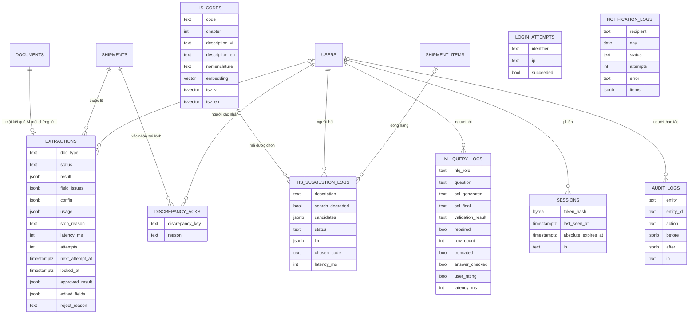
```mermaid
erDiagram
    DOCUMENTS ||--o| EXTRACTIONS : "một kết quả AI mỗi chứng từ"
    SHIPMENTS ||--o{ EXTRACTIONS : "thuộc lô"
    USERS o|--o{ EXTRACTIONS : "người duyệt"
    SHIPMENTS ||--o{ DISCREPANCY_ACKS : "xác nhận sai lệch"
    USERS ||--o{ DISCREPANCY_ACKS : "người xác nhận"
    HS_CODES o|--o{ HS_SUGGESTION_LOGS : "mã được chọn"
    USERS ||--o{ HS_SUGGESTION_LOGS : "người hỏi"
    SHIPMENT_ITEMS o|--o{ HS_SUGGESTION_LOGS : "dòng hàng"
    USERS ||--o{ NL_QUERY_LOGS : "người hỏi"
    USERS ||--o{ SESSIONS : "phiên"
    USERS o|--o{ AUDIT_LOGS : "người thao tác"

    EXTRACTIONS {
        text doc_type
        text status
        jsonb result
        jsonb field_issues
        jsonb config
        jsonb usage
        text stop_reason
        int latency_ms
        int attempts
        timestamptz next_attempt_at
        timestamptz locked_at
        jsonb approved_result
        jsonb edited_fields
        text reject_reason
    }
    DISCREPANCY_ACKS {
        text discrepancy_key
        text reason
    }
    HS_CODES {
        text code
        int chapter
        text description_vi
        text description_en
        text nomenclature
        vector embedding
        tsvector tsv_vi
        tsvector tsv_en
    }
    HS_SUGGESTION_LOGS {
        text description
        bool search_degraded
        jsonb candidates
        text status
        jsonb llm
        text chosen_code
        int latency_ms
    }
    NL_QUERY_LOGS {
        text nlq_role
        text question
        text sql_generated
        text sql_final
        text validation_result
        bool repaired
        int row_count
        bool truncated
        bool answer_checked
        bool user_rating
        int latency_ms
    }
    SESSIONS {
        bytea token_hash
        timestamptz last_seen_at
        timestamptz absolute_expires_at
        text ip
    }
    LOGIN_ATTEMPTS {
        text identifier
        text ip
        bool succeeded
    }
    AUDIT_LOGS {
        text entity
        text entity_id
        text action
        jsonb before
        jsonb after
        text ip
    }
    NOTIFICATION_LOGS {
        text recipient
        date day
        text status
        int attempts
        text error
        jsonb items
    }
```

*Hình 3.3. Mô hình dữ liệu nhóm AI và hệ thống*

- **`extractions`**: mỗi chứng từ thuộc bốn loại được AI đọc (`MBL`, `HBL`, `INVOICE`, `PACKING_LIST`) có đúng một dòng, giữ JSON trích xuất, danh sách lỗi trường do bộ kiểm phát hiện, cấu hình gọi mô hình, số token, số lần thử, thời điểm thử lại và danh sách trường người duyệt đã sửa. `discrepancy_acks` ghi việc một người "đã biết" một sai lệch đối chiếu; đây là dữ liệu chuẩn, còn bản thân kết quả đối chiếu thì tính lại mỗi lần đọc.
- **`hs_codes`**: 11.413 mã tám số chương 1–97 của Danh mục hàng hoá xuất nhập khẩu Việt Nam theo Thông tư 31/2022/TT-BTC, mô tả đã ghép các cấp cha thành một chuỗi "cha > … > lá", cột tìm kiếm toàn văn và vector 1024 chiều do bge-m3 sinh. Không có thuế suất và không có chương 98. `hs_suggestion_logs` và `nl_query_logs` ghi lại mọi lần gọi hai tính năng AI còn lại để đánh giá và tính chi phí.
- **Hệ thống**: `sessions` chỉ lưu mã băm SHA-256 của token phiên; `login_attempts` phục vụ giới hạn thử đăng nhập; `audit_logs` ghi mọi thao tác ghi theo danh sách cột cho phép của từng thực thể; `notification_logs` có ràng buộc duy nhất trên (người nhận, ngày) để một người không nhận hai email một ngày.

### 3.3.4 Những gì không phải nguồn chuẩn

Để tránh nhầm lẫn khi đọc lược đồ, các giá trị sau đều là dữ liệu suy ra, luôn có thể tính lại và không được coi là sự thật gốc:

- Cột trạng thái hiện tại của lô, container, lệnh xe, đơn giao (dựng lại từ event).
- Hạn free time, trạng thái đồng hồ, mức cảnh báo, phí ước tính (tính bằng hàm SQL mỗi lần đọc).
- Kết quả đối chiếu chứng từ (chỉ `discrepancy_acks` là chuẩn).
- Lợi nhuận lô, dashboard, báo cáo.
- Embedding của mã HS, đầu ra của LLM chưa duyệt, SQL do AI sinh, câu trả lời của trợ lý.
- Nội dung email (chỉ `notification_logs` là chuẩn).
- Giờ trên điện thoại tài xế (`device_time` chỉ để tham khảo; mốc nghiệp vụ là giờ server).

## 3.4 Máy trạng thái

### 3.4.1 Lô hàng

Vòng đời lô hàng (hình 3.4) có chín trạng thái. Từ `CREATED` tới `CLEARED` là các bước nhân viên bấm tay, chỉ theo cạnh kề, không nhảy bước; từ `CLEARED` trở đi hệ thống tự chuyển dựa trên event của lệnh xe và đơn giao (tác nhân ghi là hệ thống, `actor_id` rỗng).

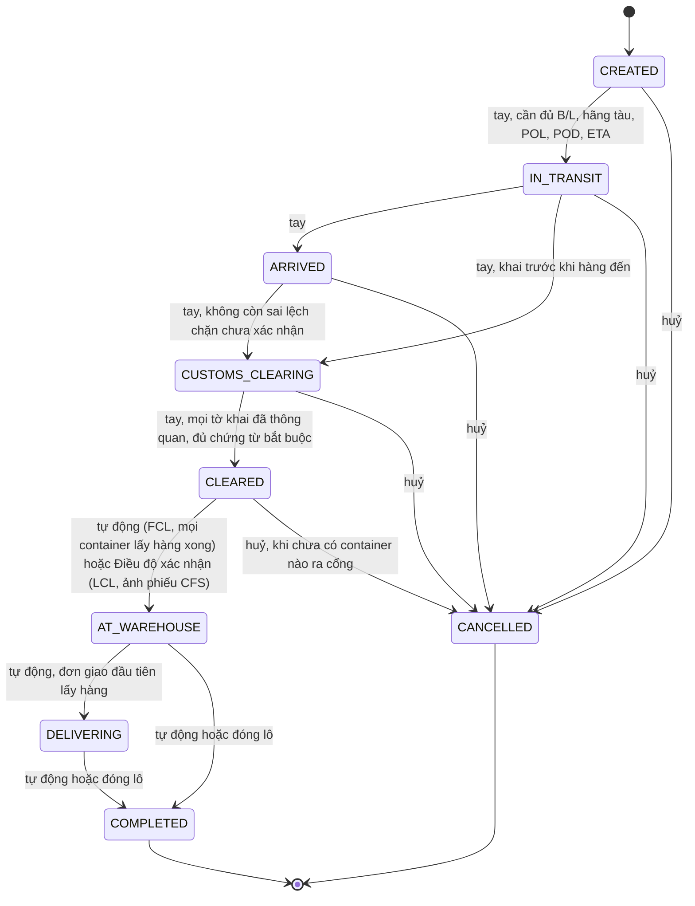
```mermaid
stateDiagram-v2
    [*] --> CREATED
    CREATED --> IN_TRANSIT : tay, cần đủ B/L, hãng tàu, POL, POD, ETA
    IN_TRANSIT --> ARRIVED : tay
    IN_TRANSIT --> CUSTOMS_CLEARING : tay, khai trước khi hàng đến
    ARRIVED --> CUSTOMS_CLEARING : tay, không còn sai lệch chặn chưa xác nhận
    CUSTOMS_CLEARING --> CLEARED : tay, mọi tờ khai đã thông quan, đủ chứng từ bắt buộc
    CLEARED --> AT_WAREHOUSE : tự động (FCL, mọi container lấy hàng xong) hoặc Điều độ xác nhận (LCL, ảnh phiếu CFS)
    AT_WAREHOUSE --> DELIVERING : tự động, đơn giao đầu tiên lấy hàng
    AT_WAREHOUSE --> COMPLETED : tự động hoặc đóng lô
    DELIVERING --> COMPLETED : tự động hoặc đóng lô
    CREATED --> CANCELLED : huỷ
    IN_TRANSIT --> CANCELLED : huỷ
    ARRIVED --> CANCELLED : huỷ
    CUSTOMS_CLEARING --> CANCELLED : huỷ
    CLEARED --> CANCELLED : huỷ, khi chưa có container nào ra cổng
    COMPLETED --> [*]
    CANCELLED --> [*]
```

*Hình 3.4. Máy trạng thái lô hàng*

Điều kiện của các cạnh:

- `CREATED → IN_TRANSIT`: phải có số B/L (MBL hoặc HBL), hãng tàu, cảng xếp, cảng dỡ và ETA; hàm `missing_for_in_transit` trả về danh sách trường còn thiếu theo thứ tự cố định để giao diện chỉ ra.
- `→ CUSTOMS_CLEARING`: bị chặn khi còn sai lệch đối chiếu mức chặn chưa có `discrepancy_acks` (mục 3.6.1).
- `CUSTOMS_CLEARING → CLEARED`: cần ít nhất một tờ khai, mọi tờ khai đều có `cleared_at`, và đủ chứng từ bắt buộc tới mốc này (bảng 3.3).
- `CLEARED → AT_WAREHOUSE`: với FCL, hệ thống tự chuyển khi mọi container đều có lệnh lấy hàng đầy (`PICKUP_FULL`) hoàn tất; lệnh bị huỷ không tính. Với LCL, Điều độ bấm "đã nhận hàng tại kho" kèm ảnh phiếu xuất kho CFS.
- `AT_WAREHOUSE → DELIVERING`: chỉ với lô giao qua kho, khi đơn giao đầu tiên có event `PICKED_UP` còn hiệu lực.
- `→ COMPLETED`: giao thẳng tới cửa: mọi container đã `EMPTY_RETURNED`. Giao qua kho: tổng kiện các đơn `DELIVERED` bằng tổng kiện của lô, không còn đơn dở (`CREATED`, `ASSIGNED`, `PICKED_UP`, `FAILED`), và với FCL mọi container đã trả vỏ. Lô chưa có đơn giao nào không bao giờ tự hoàn tất.
- **Đóng lô** (Điều độ, từ `AT_WAREHOUSE` hoặc `DELIVERING`) dành cho trường hợp không giao thêm được (khách tự nhận, từ chối nhận): bắt buộc lý do và ảnh biên bản, vẫn phải không còn đơn dở và (FCL) mọi container đã trả vỏ.
- **Huỷ lô**: chỉ khi chưa có mốc `GATE_OUT_FULL` còn hiệu lực, bắt buộc lý do; lệnh xe `PLANNED` / `ASSIGNED` tự huỷ, trích xuất `PENDING` bị huỷ, khoản thu chi giữ nguyên.
- Mốc `DISCHARGED` chỉ ghi được khi lô ở `ARRIVED`, `CUSTOMS_CLEARING` hoặc `CLEARED`; thứ tự mốc container cố định là `DISCHARGED → GATE_OUT_FULL → EMPTY_RETURNED`.

Mọi thao tác đổi trạng thái của container, lệnh xe hay đơn giao đều mở đầu bằng `lock_shipment()`, tức `SELECT … FROM shipments WHERE id = :id FOR UPDATE`, rồi ghi event và gọi `try_auto_advance()` kiểm tra các cạnh tự động, tất cả trong cùng một transaction. Khoá theo lô là đơn vị tranh chấp tự nhiên: hai tài xế bấm cùng lúc trên hai container của một lô sẽ được xử lý tuần tự, còn hai lô khác nhau không cản nhau. Khi một event bị `VOID`, hàm `revert_auto_advance` kiểm tra lại điều kiện của các bước tự động mà event đó đã gây ra và đảo lại bằng event hệ thống nếu điều kiện không còn đúng.

### 3.4.2 Lệnh xe

Lệnh xe có hai loại: `PICKUP_FULL` (cảng → kho đích) và `RETURN_EMPTY` (kho → depot). Mỗi container có tối đa một lệnh chưa huỷ mỗi loại; lệnh trả vỏ chỉ tạo được khi lệnh lấy hàng của container đó đã hoàn tất.

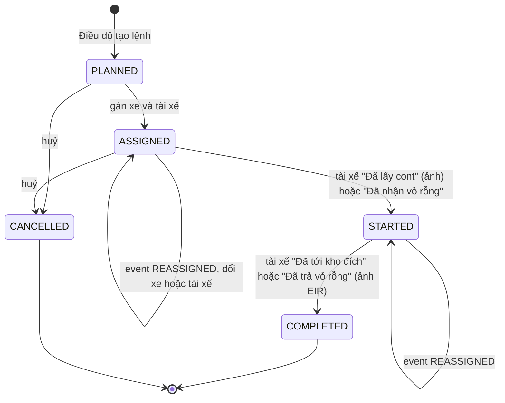
```mermaid
stateDiagram-v2
    [*] --> PLANNED : Điều độ tạo lệnh
    PLANNED --> ASSIGNED : gán xe và tài xế
    ASSIGNED --> STARTED : tài xế "Đã lấy cont" (ảnh) hoặc "Đã nhận vỏ rỗng"
    STARTED --> COMPLETED : tài xế "Đã tới kho đích" hoặc "Đã trả vỏ rỗng" (ảnh EIR)
    PLANNED --> CANCELLED : huỷ
    ASSIGNED --> CANCELLED : huỷ
    ASSIGNED --> ASSIGNED : event REASSIGNED, đổi xe hoặc tài xế
    STARTED --> STARTED : event REASSIGNED
    COMPLETED --> [*]
    CANCELLED --> [*]
```

*Hình 3.5. Máy trạng thái lệnh xe*

Đổi xe hoặc tài xế khi lệnh đang `ASSIGNED` / `STARTED` không phải là cạnh chuyển trạng thái mà là event `REASSIGNED` kèm lý do; hàm `derive_status` suy trạng thái hiệu lực bằng cách bỏ qua `REASSIGNED` và lấy event cuối trong bốn loại còn lại. Với `PICKUP_FULL`, cạnh `ASSIGNED → STARTED` chỉ mở khi lô đã `CLEARED` và container đã có mốc `DISCHARGED`; event này đồng thời ghi mốc `GATE_OUT_FULL` cho container với cùng `occurred_at`, nên đồng hồ DEM đóng và DET mở ngay lúc tài xế bấm. Tương tự, hoàn tất `RETURN_EMPTY` ghi mốc `EMPTY_RETURNED`.

### 3.4.3 Đơn giao nội địa

Đơn giao chỉ tồn tại ở lô giao qua kho, được tách từ "quỹ kiện" của lô: tổng kiện các đơn chưa huỷ, chưa hoàn không được vượt tổng kiện lô; kiện của đơn `RETURNED` / `CANCELLED` trả về quỹ để tách lại.

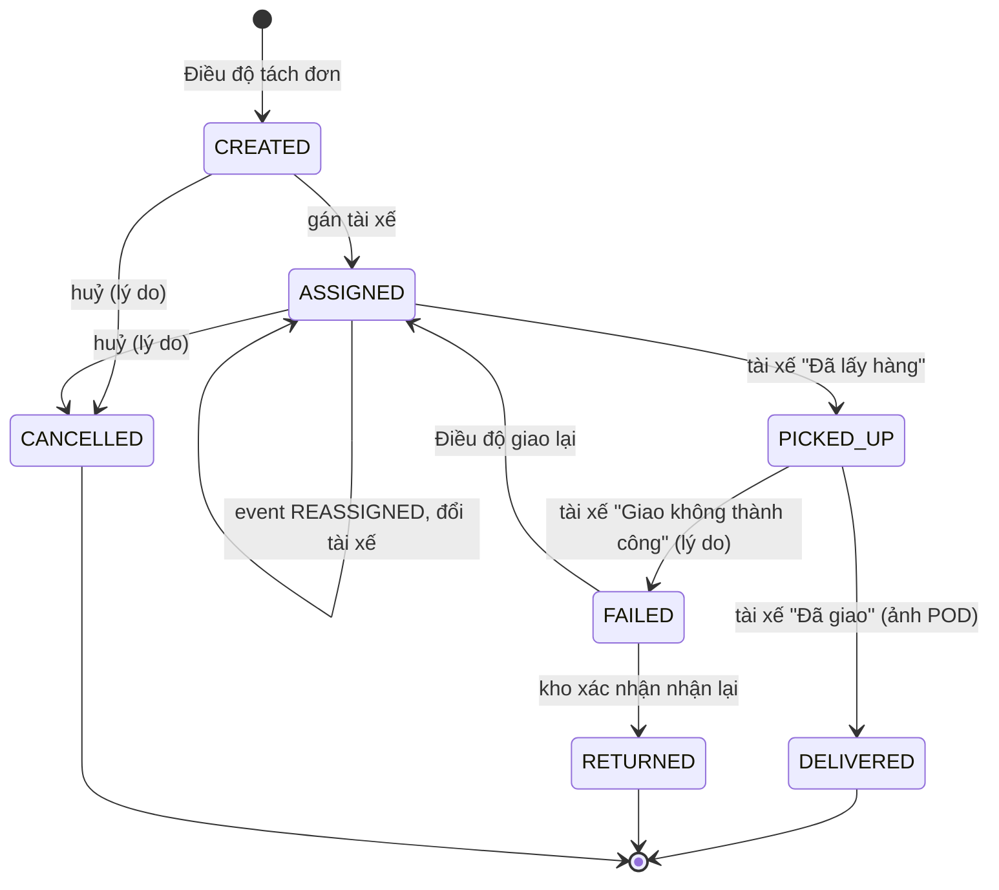
```mermaid
stateDiagram-v2
    [*] --> CREATED : Điều độ tách đơn
    CREATED --> ASSIGNED : gán tài xế
    ASSIGNED --> PICKED_UP : tài xế "Đã lấy hàng"
    PICKED_UP --> DELIVERED : tài xế "Đã giao" (ảnh POD)
    PICKED_UP --> FAILED : tài xế "Giao không thành công" (lý do)
    FAILED --> ASSIGNED : Điều độ giao lại
    FAILED --> RETURNED : kho xác nhận nhận lại
    CREATED --> CANCELLED : huỷ (lý do)
    ASSIGNED --> CANCELLED : huỷ (lý do)
    ASSIGNED --> ASSIGNED : event REASSIGNED, đổi tài xế
    DELIVERED --> [*]
    RETURNED --> [*]
    CANCELLED --> [*]
```

*Hình 3.6. Máy trạng thái đơn giao nội địa*

Mỗi đơn có mã vận đơn công khai 10 ký tự bảng chữ Crockford Base32 sinh bằng bộ sinh ngẫu nhiên mật mã; người nhận tra cứu bằng mã này mà không cần đăng nhập (mục 3.7).

### 3.4.4 Trích xuất chứng từ

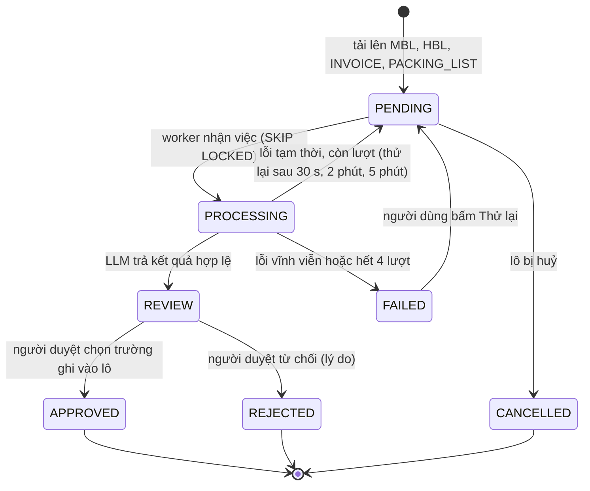
```mermaid
stateDiagram-v2
    [*] --> PENDING : tải lên MBL, HBL, INVOICE, PACKING_LIST
    PENDING --> PROCESSING : worker nhận việc (SKIP LOCKED)
    PROCESSING --> REVIEW : LLM trả kết quả hợp lệ
    PROCESSING --> PENDING : lỗi tạm thời, còn lượt (thử lại sau 30 s, 2 phút, 5 phút)
    PROCESSING --> FAILED : lỗi vĩnh viễn hoặc hết 4 lượt
    FAILED --> PENDING : người dùng bấm Thử lại
    REVIEW --> APPROVED : người duyệt chọn trường ghi vào lô
    REVIEW --> REJECTED : người duyệt từ chối (lý do)
    PENDING --> CANCELLED : lô bị huỷ
    APPROVED --> [*]
    REJECTED --> [*]
    CANCELLED --> [*]
```

*Hình 3.7. Máy trạng thái trích xuất chứng từ*

Worker lấy việc bằng `FOR UPDATE SKIP LOCKED` nên nhiều tiến trình worker chạy song song không giẫm nhau; việc `PROCESSING` có `locked_at` quá 10 phút (worker chết giữa chừng) được trả về `PENDING`. Lỗi tạm thời (429, 5xx, quá giờ, lỗi mạng) được thử lại tối đa bốn lượt với khoảng chờ tăng dần; lỗi vĩnh viễn (400, nội dung không nhận diện được) chuyển `FAILED` ngay.

### 3.4.5 Thao tác của tài xế

Mọi thao tác của tài xế đi qua một endpoint duy nhất `POST /api/driver/actions` với bảng thao tác cố định (bảng 3.4). Yêu cầu mang `client_request_id` (UUID do máy tài xế sinh): gửi lại cùng mã thì server trả lại kết quả cũ mà không ghi thêm event, nhờ đó ứng dụng có thể gửi lại vô điều kiện khi mất mạng. Server khoá lô, kiểm trạng thái hiện tại của lệnh hoặc đơn, kiểm bằng chứng bắt buộc, rồi ghi event với `occurred_at` là giờ server; giờ trên điện thoại chỉ lưu tham khảo ở cột `device_time`.

*Bảng 3.4. Thao tác của tài xế và bằng chứng bắt buộc*

| Mã | Nhãn trên app | Đối tượng | Cạnh | Bằng chứng |
| --- | --- | --- | --- | --- |
| `TRUCK_START` | Đã lấy cont | Lệnh `PICKUP_FULL` | `ASSIGNED → STARTED` | Ảnh container và seal |
| `TRUCK_COMPLETE` | Đã tới kho đích | Lệnh `PICKUP_FULL` | `STARTED → COMPLETED` | Với lô giao thẳng tới cửa: ảnh POD và tên người ký nhận |
| `RETURN_START` | Đã nhận vỏ rỗng tại kho | Lệnh `RETURN_EMPTY` | `ASSIGNED → STARTED` | Không |
| `RETURN_COMPLETE` | Đã trả vỏ rỗng | Lệnh `RETURN_EMPTY` | `STARTED → COMPLETED` | Ảnh phiếu EIR |
| `LM_PICK_UP` | Đã lấy hàng | Đơn giao | `ASSIGNED → PICKED_UP` | Không |
| `LM_DELIVER` | Đã giao | Đơn giao | `PICKED_UP → DELIVERED` | Ảnh POD |
| `LM_FAIL` | Giao không thành công | Đơn giao | `PICKED_UP → FAILED` | Lý do |

Thiếu bằng chứng thì server trả lỗi `EVIDENCE_REQUIRED` kèm danh sách còn thiếu (ví dụ `["signer_name"]`), và trạng thái không đổi.

## 3.5 Free time DEM/DET

### 3.5.1 Ba đồng hồ

Phí lưu container tại cảng (demurrage, DEM) và phí lưu vỏ ngoài cảng (detention, DET) được hãng tàu miễn trong một số ngày (free time), sau đó tính theo bậc luỹ tiến. Hệ thống mô hình hoá bằng ba loại đồng hồ (hình 3.8), mỗi đồng hồ chạy giữa hai mốc container:

- `DEM`: từ `DISCHARGED` (dỡ khỏi tàu) tới `GATE_OUT_FULL` (kéo container đầy ra khỏi cảng).
- `DET`: từ `GATE_OUT_FULL` tới `EMPTY_RETURNED` (trả vỏ về depot).
- `COMBINED`: từ `DISCHARGED` tới `EMPTY_RETURNED`, dùng khi hãng tàu tính gộp.

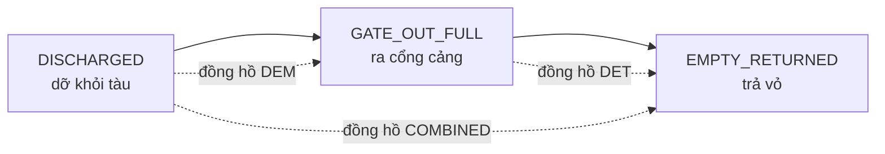
```mermaid
flowchart LR
    D[DISCHARGED<br/>dỡ khỏi tàu] --> G[GATE_OUT_FULL<br/>ra cổng cảng] --> E[EMPTY_RETURNED<br/>trả vỏ]
    D -. "đồng hồ DEM" .-> G
    G -. "đồng hồ DET" .-> E
    D -. "đồng hồ COMBINED" .-> E
```

*Hình 3.8. Ba mốc container và ba đồng hồ free time*

Ngày được đếm theo lịch giờ Việt Nam, tính cả ngày đầu lẫn ngày cuối; ngày `GATE_OUT_FULL` vì thế tính vào cả DEM lẫn DET, đúng như cách hãng tàu tính. Đồng hồ chưa có mốc kết thúc thì đếm tới ngày tham chiếu (hôm nay). Một lô có override thì dùng loại đồng hồ của override; không thì theo quy tắc hãng tàu; không có gì thì mặc định cặp `DEM` + `DET`.

### 3.5.2 Chọn quy tắc và bậc phí

Với mỗi container của lô FCL, hệ thống chọn quy tắc theo thứ tự:

1. Override của lô cho loại phí đó (`shipment_free_time_overrides`), nếu có.
2. Quy tắc `free_time_rules` khớp hãng tàu × cảng dỡ × loại container × loại phí, lấy phiên bản có `effective_from` lớn nhất nhưng không muộn hơn ngày `DISCHARGED` (chưa dỡ thì lấy theo ngày tham chiếu).
3. Không có gì: đồng hồ ở trạng thái `NO_RULE`.

Bậc phí của một quy tắc là dãy `free_time_tiers` liền nhau theo số ngày tuyệt đối: bậc đầu bắt đầu từ ngày `free_days + 1`, bậc cuối có `to_day` rỗng nghĩa là "trở đi". Phí ước tính là tổng trên các bậc của (số ngày đã dùng rơi vào bậc đó, chỉ tính phần vượt free) nhân đơn giá, theo tiền tệ của tariff. Quy tắc chỉ được sửa bằng cách thêm phiên bản có ngày hiệu lực mới, nên phí của lô cũ không đổi khi hãng tàu đổi giá.

### 3.5.3 Trạng thái đồng hồ

*Bảng 3.5. Trạng thái của một đồng hồ*

| Trạng thái | Điều kiện | Mức cảnh báo |
| --- | --- | --- |
| `NOT_STARTED` | Chưa có mốc bắt đầu và chưa tới lúc cần có | (không) |
| `MISSING_DATA` | Đồng hồ `DEM` / `COMBINED` chưa có mốc `DISCHARGED` trong khi ETA đã qua hoặc lô đã ở `ARRIVED` trở đi: có lẽ nhân viên quên nhập | `MISSING_DATA` |
| `OPEN` | Có mốc bắt đầu, chưa có mốc kết thúc, có quy tắc | `GREEN` còn trên 2 ngày, `YELLOW` còn 0–2 ngày, `RED` đã quá hạn |
| `CLOSED` | Đã có mốc kết thúc; kèm số ngày quá hạn và phí cuối | (không) |
| `NO_RULE` | Có mốc bắt đầu nhưng không tìm được quy tắc | `NO_RULE` |

Mức của một container là mức xấu nhất trong các đồng hồ của nó theo thứ tự `RED > YELLOW > NO_RULE > MISSING_DATA > GREEN`. Chỉ container của lô FCL chưa huỷ, chưa hoàn tất và có đồng hồ đang mở mới vào email nhắc hạn và dashboard; đồng hồ `CLOSED` vẫn hiện trên bảng free time và báo cáo. Ngoài ba đồng hồ, dashboard và email còn có cảnh báo `DO_EXPIRING` khi lệnh giao hàng (D/O) hết hạn trong vòng một ngày mà còn container chưa ra cổng.

### 3.5.4 Một hàm SQL dùng chung

Toàn bộ logic trên nằm trong một hàm SQL `container_freetime(as_of date)` (migration `0006_freetime`), trả về một dòng cho mỗi cặp (container, đồng hồ) với đủ mốc, số ngày, hạn, mức và phí ước tính. Hàm không lưu gì; nó đọc `effective_container_milestones` (view đã áp `RETIME` / `VOID`) nên chỉnh giờ hay huỷ mốc là free time tính lại ngay. Hàm được khai báo `SECURITY DEFINER` với `search_path` cố định và thu hồi quyền khỏi `PUBLIC`, rồi cấp `EXECUTE` tường minh cho các role cần dùng. API bảng free time, email nhắc hạn và trợ lý hỏi đáp (qua view `nlq.v_container_freetime`, gọi hàm với ngày tham chiếu `nlq_today()`) đều đọc cùng một hàm, nên ba nơi không thể cho ra ba con số khác nhau. Ngày tham chiếu có thể cố định bằng biến `APP_TODAY` (đặt vào GUC `app.as_of` trong mọi transaction) để kiểm thử và demo tái lập được.

### 3.5.5 Ví dụ tính tay

Dữ liệu demo dùng quy tắc: container `40HC` được miễn DEM 5 ngày, sau đó ngày thứ 6 đến 10 giá 20 USD/ngày, từ ngày 11 trở đi 40 USD/ngày; DET miễn 7 ngày, từ ngày 8 giá 10 USD/ngày. Một container dỡ ngày 10/09, ra cổng ngày 22/09, trả vỏ ngày 30/09 (bảng 3.6).

*Bảng 3.6. Ví dụ tính phí DEM/DET nhiều bậc*

| Đồng hồ | Bắt đầu | Kết thúc | Ngày dùng | Free | Quá hạn | Bậc áp dụng | Phí |
| --- | --- | --- | --- | --- | --- | --- | --- |
| DEM | 10/09 | 22/09 | 13 | 5 | 8 | Ngày 6–10: 5 ngày × 20 = 100; ngày 11–13: 3 ngày × 40 = 120 | 220 USD |
| DET | 22/09 | 30/09 | 9 | 7 | 2 | Ngày 8–9: 2 ngày × 10 | 20 USD |

Số ngày dùng = ngày kết thúc − ngày bắt đầu + 1 (13 và 9). Với DEM, 8 ngày quá hạn rơi vào hai bậc: 5 ngày ở bậc 20 USD và 3 ngày ở bậc 40 USD. Nếu chỉ đang xét ngày 15/09 khi container chưa ra cổng, đồng hồ DEM ở trạng thái `OPEN`, đã dùng 6 ngày, quá hạn 1 ngày, mức `RED`, phí ước tính 20 USD; hai ngày trước đó (13/09, còn 0 ngày) mức là `YELLOW`. Ảnh chụp ở mục 3.8 (hình 3.15) cho thấy lô `FF2600010` với các container quá hạn 4–5 ngày và phí ước tính 80–100 USD, đúng theo bậc 20 USD/ngày này.

## 3.6 Ba tính năng AI

Ba tính năng dùng chung một nguyên tắc: mô hình ngôn ngữ chỉ đề xuất, mã kiểm tra bằng luật xác định ở phía sau, và người dùng là người quyết định trước khi dữ liệu nghiệp vụ thay đổi. Mọi lời gọi mô hình đều qua `call_structured` với lược đồ đầu ra bắt buộc, nội dung do người dùng hoặc tài liệu cung cấp được đặt trong khối dữ liệu có nhãn, ký tự `<` `>` bị thay để không đóng được khối, và prompt dặn bỏ qua mọi chỉ dẫn nằm trong dữ liệu. Ba lớp phòng vệ (mục 3.7.5) không tin vào việc mô hình làm theo lời dặn.

### 3.6.1 AI #1: đọc và đối chiếu chứng từ

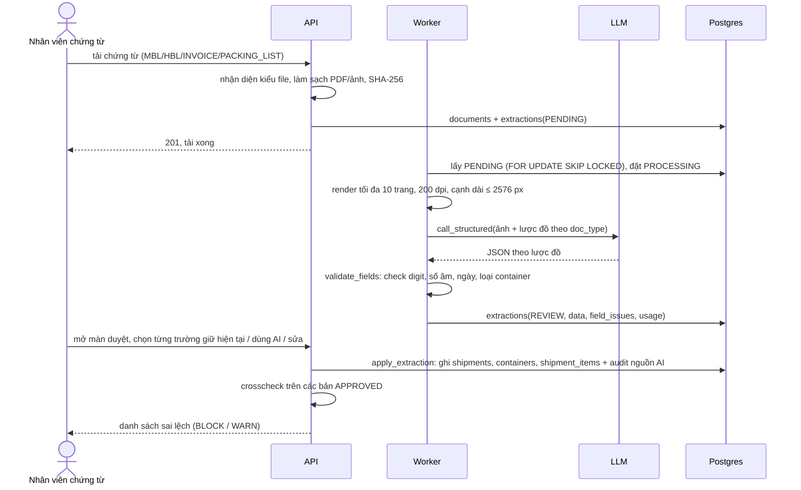
```mermaid
sequenceDiagram
    actor NV as Nhân viên chứng từ
    participant API
    participant W as Worker
    participant LLM
    participant DB as Postgres
    NV->>API: tải chứng từ (MBL/HBL/INVOICE/PACKING_LIST)
    API->>API: nhận diện kiểu file, làm sạch PDF/ảnh, SHA-256
    API->>DB: documents + extractions(PENDING)
    API-->>NV: 201, tải xong
    W->>DB: lấy PENDING (FOR UPDATE SKIP LOCKED), đặt PROCESSING
    W->>W: render tối đa 10 trang, 200 dpi, cạnh dài ≤ 2576 px
    W->>LLM: call_structured(ảnh + lược đồ theo doc_type)
    LLM-->>W: JSON theo lược đồ
    W->>W: validate_fields: check digit, số âm, ngày, loại container
    W->>DB: extractions(REVIEW, data, field_issues, usage)
    NV->>API: mở màn duyệt, chọn từng trường giữ hiện tại / dùng AI / sửa
    API->>DB: apply_extraction: ghi shipments, containers, shipment_items + audit nguồn AI
    API->>API: crosscheck trên các bản APPROVED
    API-->>NV: danh sách sai lệch (BLOCK / WARN)
```

*Hình 3.9. Trình tự đọc và đối chiếu chứng từ*

**Trích xuất.** Worker chuyển chứng từ thành ảnh (PDF: tối đa 10 trang đầu ở 200 dpi; ảnh: xoay theo EXIF, cạnh dài không quá 2576 px, JPEG chất lượng 85) rồi gửi cho mô hình kèm lược đồ tương ứng với loại chứng từ: `BLExtract` (số B/L, hãng tàu, người gửi, người nhận, bên nhận thông báo, tàu, chuyến, POL, POD, ngày xếp tàu, tổng kiện, tổng trọng lượng, danh sách container với số, seal, loại, kiện, trọng lượng), `InvoiceExtract` (số, ngày, người bán, người mua, tiền tệ, Incoterm, tổng tiền, các dòng hàng) và `PackingListExtract` (tổng kiện, trọng lượng gộp và tịnh, dòng hàng, container). Mọi trường nghiệp vụ đều có thể rỗng; lược đồ có thêm `detected_doc_type` (kể cả `UNKNOWN`), `legible` và `suspicious_content` để mô hình báo ảnh không đọc được hoặc tài liệu có nội dung bất thường thay vì đoán. Loại container ghi cả chuỗi thô lẫn mã đã chuẩn hoá qua bảng ánh xạ ISO 6346 (ví dụ `45G1 → 40HC`).

**Kiểm sau khi nhận.** Hàm `validate_fields` chạy trên JSON trả về: số container phải đúng check digit ISO 6346, các đại lượng (kiện, trọng lượng, tiền) không âm, ngày nằm trong khoảng ba năm trước tới 366 ngày sau, số trang khớp. Lỗi không làm hỏng kết quả mà được gắn vào từng trường để màn duyệt tô đỏ.

**Duyệt.** Màn duyệt đặt ảnh chứng từ cạnh biểu mẫu (hình 3.16). Với mỗi trường đã có giá trị trong lô, người duyệt phải chọn "giữ hiện tại" hoặc "dùng AI đọc được"; trường có lỗi phải sửa; các trường chỉ đọc (`detected_doc_type`, `legible`, `suspicious_content`) không ghi vào lô. Chỉ trường được chọn mới ghi, giá trị AI không bao giờ tự đè dữ liệu có sẵn. Khi duyệt, `apply_extraction` ghi vào `shipments`, `containers`, `shipment_items` trong cùng transaction với audit ghi rõ trường nào lấy từ AI, trường nào người dùng sửa (`edited_fields`). Từ chối cần lý do; "Thử lại" đặt lại số lượt và đưa việc về `PENDING`.

**Đối chiếu.** Đối chiếu không dùng mô hình. Hàm `crosscheck` chạy trên các bản trích xuất `APPROVED` của những chứng từ chưa bị thay thế, theo bốn luật xác định (bảng 3.7). Sai lệch mức `BLOCK` chưa có `discrepancy_acks` sẽ chặn cạnh sang `CUSTOMS_CLEARING`; xác nhận "đã biết" cần lý do và được ghi audit.

*Bảng 3.7. Luật đối chiếu chứng từ*

| Luật | So sánh | Mức |
| --- | --- | --- |
| Container và seal | Tập số container trên MBL, HBL, packing list phải trùng nhau; seal phải gắn đúng container | `BLOCK` với FCL, `WARN` với LCL (LCL không tạo container, số cont consol chỉ tham khảo) |
| Tổng số kiện | MBL, HBL, packing list | `WARN` |
| Trọng lượng gộp | MBL, HBL, packing list; lệch quá 0,5 % | `WARN` |
| Người nhận | Consignee trên HBL so với người mua trên invoice, sau khi chuẩn hoá (viết hoa, bỏ dấu, bỏ dấu câu, bỏ hậu tố pháp lý) bằng độ giống tập token; consignee "TO ORDER…" thì so bên nhận thông báo; MBL không so | `WARN` |

### 3.6.2 AI #2: gợi ý mã HS

```mermaid
sequenceDiagram
    actor NV as Nhân viên chứng từ
    participant API
    participant DB as Postgres (hs_codes)
    participant EMB as bge-m3 (cục bộ)
    participant LLM
    NV->>API: POST /api/hs/suggest, mô tả hàng (≤ 500 ký tự)
    API->>DB: nhánh K: full-text vn_simple, top 50
    API->>EMB: mã hoá mô tả thành vector 1024 chiều
    API->>DB: nhánh V: cosine trên chỉ mục HNSW, top 50
    API->>API: trộn RRF (k = 60), giữ 20 ứng viên
    alt cosine của ứng viên đầu < τ
        API-->>NV: "chưa đủ thông tin", gợi ý mô tả thêm chất liệu, công dụng
    else
        API->>LLM: call_structured(mô tả + 20 ứng viên)
        LLM-->>API: ≤ 3 mã kèm giải thích, hoặc cờ insufficient
        API->>API: chỉ nhận mã nằm trong danh sách ứng viên
        API->>DB: hs_suggestion_logs
        API-->>NV: top 3 + thứ hạng tìm kiếm + điểm; mã ngoài top 5 tìm kiếm gắn "cần xem kỹ"
    end
    NV->>API: chọn một mã cho dòng hàng
    API->>DB: shipment_items.hs_code, hs_source = ai_accepted (nếu mã vừa được gợi ý cho chính người này)
```

*Hình 3.10. Trình tự gợi ý mã HS*

Đây là một hệ sinh văn bản có truy hồi (RAG) hai nhánh trên 11.413 mã của Thông tư 31/2022. Nhánh từ khoá dùng tìm kiếm toàn văn Postgres với cấu hình `vn_simple` (tách từ đơn giản cộng `unaccent` để bỏ dấu), khớp bất kỳ từ nào và xếp bằng `ts_rank_cd`; nhánh ngữ nghĩa dùng vector bge-m3 với khoảng cách cosine trên chỉ mục HNSW (`ef_search = 100`). Mỗi nhánh lấy 50 kết quả; hai danh sách trộn bằng Reciprocal Rank Fusion với $k = 60$ và giữ 20 ứng viên đầu. Nếu độ tương đồng cosine của ứng viên đứng đầu thấp hơn ngưỡng $\tau$ (cấu hình `HS_TAU`, hiện đặt tạm 0,35 trong lúc chờ hiệu chỉnh trên tập dev), hệ thống không gọi mô hình mà trả lời "chưa đủ thông tin" kèm gợi ý mô tả thêm chất liệu, công dụng, cấu tạo.

Mô hình ngôn ngữ chỉ làm việc chọn: nhận mô tả và 20 ứng viên, trả về tối đa ba mã kèm giải thích ngắn (≤ 400 ký tự) hoặc cờ `insufficient`. Mã nằm ngoài danh sách ứng viên bị loại bỏ ở phía mã, nên mô hình không thể "bịa" mã. Giao diện hiện cả thứ hạng tìm kiếm và điểm của từng mã; mã được mô hình xếp nhất nhưng nằm ngoài top 5 tìm kiếm được gắn nhãn "cần xem kỹ". Khi mô hình lỗi hoặc bge-m3 chưa nạp xong, hệ thống trả kết quả tìm kiếm rút gọn (5 mã) để nhân viên vẫn làm việc được.

Mã HS chỉ vào `shipment_items` khi người dùng chọn. Nguồn `ai_accepted` chỉ được ghi khi chính người gọi vừa được gợi ý mã đó (kiểm qua `hs_suggestion_logs`); mọi trường hợp khác là `manual`. Nhờ vậy tỷ lệ chấp nhận gợi ý đo được từ dữ liệu vận hành mà không dựa vào tự khai.

### 3.6.3 AI #3: hỏi đáp dữ liệu bằng tiếng Việt

```mermaid
sequenceDiagram
    actor U as Nhân viên
    participant API
    participant LLM
    participant V as Validator (sqlglot)
    participant PG as Postgres (role nlq_ops / nlq_finance)
    U->>API: câu hỏi tiếng Việt (3–500 ký tự)
    API->>API: vai trò → role nlq, mô tả view từ information_schema + COMMENT, ví dụ mẫu, ngày tham chiếu
    API->>LLM: sinh SQL (hoặc NO_PERMISSION)
    LLM-->>API: một câu SELECT
    API->>V: validate_sql
    V-->>API: SQL chuẩn hoá có schema và LIMIT, hoặc từ chối
    API->>PG: kết nối riêng bằng role nlq, BEGIN READ ONLY, statement_timeout 5 s
    PG-->>API: ≤ 500 dòng, luôn ROLLBACK
    alt SQL lỗi khi chạy
        API->>LLM: sửa một lần (kèm thông báo lỗi)
        API->>V: kiểm lại rồi chạy lại
    end
    API->>LLM: viết câu trả lời từ ≤ 50 dòng đầu, gợi ý biểu đồ {type, x, y}
    LLM-->>API: câu trả lời
    API->>API: numbers_supported: mọi số trong câu trả lời phải có trong bảng; kiểm cột biểu đồ
    API-->>U: bảng kết quả + câu trả lời (chỉ khi khớp số) + biểu đồ
    U->>API: chấm 👍 / 👎
```

*Hình 3.11. Trình tự hỏi đáp dữ liệu*

Bài toán là chuyển câu hỏi tiếng Việt thành SQL (text-to-SQL) trên một lược đồ đã thu hẹp: mô hình không thấy bảng gốc mà chỉ thấy các view trong schema `nlq` (bảng 3.8). View không có số điện thoại, địa chỉ, mã số thuế; tên người nhận được che bằng đúng hàm của trang tra cứu công khai (`nlq.mask_name`, giữ chữ cái đầu mỗi từ: "V*** Q*** H***"); số tiền đưa về đơn vị chính (USD thay vì cent). Mô tả view gửi cho mô hình sinh tự động từ `information_schema` và `COMMENT ON COLUMN`, kèm bảy cặp câu hỏi–SQL mẫu và ngày tham chiếu `nlq_today()`.

*Bảng 3.8. View trong schema `nlq` theo vai trò*

| View | Nội dung | `nlq_ops` (DOCS, DISPATCH) | `nlq_finance` (ADMIN, ACCOUNTANT) |
| --- | --- | :-: | :-: |
| `v_shipments` | Lô: mã, trạng thái, loại, khách, hãng tàu, POL/POD, ETD/ETA, nhân viên, số container | ✓ | ✓ |
| `v_trucking` | Lệnh xe: container, loại, trạng thái, nhà xe, tài xế, giờ dự kiến, mốc hiệu lực | ✓ | ✓ |
| `v_last_mile` | Đơn giao: mã lô, người nhận đã che, kiện, trọng lượng, tài xế, trạng thái, thời điểm giao | ✓ | ✓ |
| `v_container_freetime` | Kết quả `container_freetime(nlq_today())` | ✓ | ✓ |
| `v_charges` | Thu chi theo lô, hạng mục, số tiền đơn vị chính, `amount_vnd` | | ✓ |

Câu SQL đi qua hai lớp phòng vệ độc lập. Lớp thứ nhất là bộ kiểm cú pháp bằng `sqlglot`: đúng một câu, chỉ `SELECT`, không có nút `Insert` / `Update` / `Delete` / `Create` / `Drop` / `Alter` / `Into` / `Lock` hay lệnh quản trị, mọi bảng phải là view được phép của vai trò trong schema `nlq`, hàm và kiểu ép chỉ trong danh sách trắng (cấm `now()`, `current_date`, `set_config`, `query_to_xml`, các hàm `pg_*`, `generate_series`, `UNNEST`), không CTE đệ quy, không tham số, không `FETCH`; câu dài quá 5.000 ký tự bị từ chối; `LIMIT` bị ép về tối đa 500 (thực tế lấy 501 dòng để phát hiện bị cắt). Bộ kiểm trả về chuỗi SQL do `sqlglot` sinh lại, không chạy chuỗi gốc. Lớp thứ hai là quyền Postgres: câu chạy trên một kết nối riêng đăng nhập thẳng bằng role `nlq_ops` hoặc `nlq_finance` (`LOGIN NOSUPERUSER NOCREATEDB NOCREATEROLE NOINHERIT`), chỉ có `SELECT` trên view được phép và `EXECUTE` trên ba hàm cần thiết, trong transaction `READ ONLY` với `statement_timeout = 5s`, `lock_timeout = 1s`, luôn `ROLLBACK`. Nếu bộ kiểm bỏ sót, câu vẫn không đọc được bảng gốc và không ghi được gì.

Câu trả lời tiếng Việt được viết bởi mô hình từ tối đa 50 dòng kết quả đầu; mọi phép tính phải nằm trong SQL. Hàm `numbers_supported` trích mọi con số trong câu trả lời (kể cả ngày dạng Việt Nam) và kiểm chúng có trong bảng kết quả với sai số 1 %; không khớp thì chỉ hiện bảng, không hiện câu trả lời. Gợi ý biểu đồ (`bar` / `line` / `pie`) được kiểm cột tồn tại và cột giá trị là số. Câu hỏi cần view không được phép trả về `NO_PERMISSION` với thông điệp cố định. Mọi lượt hỏi ghi vào `nl_query_logs` với câu hỏi, SQL, kết quả kiểm, số dòng, việc câu trả lời có qua kiểm số hay không, token, độ trễ và điểm người dùng chấm.

### 3.6.4 Ranh giới giữa AI và dữ liệu chuẩn

Tóm lại, ranh giới được vạch như sau: AI #1 chỉ trích xuất, đối chiếu là luật; AI #2 chỉ chọn trong ứng viên do tìm kiếm cung cấp, mã vào dữ liệu khi người dùng chọn; AI #3 chỉ thấy view đã che, SQL phải qua bộ kiểm và role chỉ đọc, câu trả lời phải khớp số. Mọi tính năng tắt được bằng cờ `AI_EXTERNAL_ENABLED`, khi đó nhập tay và tìm kiếm HS thuần vẫn chạy. Hạn mức theo người dùng (30 lượt/giờ cho #1 và #3, 60 lượt/giờ cho #2) và trần token mỗi ngày (`AI_DAILY_TOKEN_BUDGET`, mặc định 2.000.000) tính gộp cả ba tính năng; vượt trần thì AI tạm dừng và Admin được báo.

## 3.7 Bảo mật

### 3.7.1 Phiên và đăng nhập

Phiên lưu phía server: token phiên ngẫu nhiên, cơ sở dữ liệu chỉ giữ mã băm SHA-256, gửi cho trình duyệt trong cookie `__Host-sid` với `Secure`, `HttpOnly`, `SameSite=Lax`, `Path=/`. Phiên hết hạn khi không hoạt động 8 giờ với nhân viên nội bộ, 7 ngày với tài xế và khách hàng, và tuyệt đối sau 30 ngày. Đổi mật khẩu, đổi vai trò hay khoá tài khoản thu hồi mọi phiên của người đó. Mật khẩu băm bằng Argon2id.

Giới hạn thử đăng nhập theo cặp (tài khoản, IP): sai từ lần thứ 5 trong cửa sổ 15 phút thì phải chờ với thời gian tăng dần tới tối đa 15 phút; mỗi IP không quá 20 lần sai trong 15 phút. Mọi lỗi đăng nhập trả cùng một câu và tốn cùng thời gian (băm một mật khẩu giả khi tài khoản không tồn tại) để không lộ tài khoản nào có thật. Admin mở khoá và đặt lại mật khẩu, có audit.

### 3.7.2 CSRF và phân quyền

Một middleware từ chối mọi yêu cầu `POST` / `PUT` / `PATCH` / `DELETE` có header `Sec-Fetch-Site` khác `same-origin` hoặc `Origin` khác origin cấu hình; không có yêu cầu `GET` nào đổi trạng thái. Phân quyền hai lớp: `require(action)` trên từng endpoint đối chiếu bảng 3.2; hàm scope (`scope_shipments`, `scope_trucking`, `scope_last_mile`) lọc theo dòng cho khách hàng và tài xế, và `get_scoped_or_404` trả 404 cho cả bản ghi không tồn tại lẫn bản ghi của người khác để không lộ sự tồn tại. Tài xế không có quyền đọc lô; cổng khách hàng chỉ trả các trường được phép và chứng từ có `visible_to_customer`, tải về với `Content-Disposition: attachment`.

### 3.7.3 Nhật ký thao tác

`record_audit()` chạy trong cùng transaction với thao tác ghi, chỉ ghi các cột trong danh sách `AUDIT_FIELDS` của từng thực thể; cột bí mật (như băm mật khẩu) chỉ ghi `<changed>`; địa chỉ IP lấy từ header do Caddy ghi đè. Bảng `audit_logs` là append-only. Bộ kiểm thử chứng minh bằng đột biến rằng cả 48 route ghi đều để lại dòng audit (bỏ một lời gọi `record_audit` thì kiểm thử đỏ) và audit không chứa mật khẩu rõ, băm mật khẩu hay token phiên.

### 3.7.4 File tải lên và tra cứu công khai

Kiểu file nhận diện theo nội dung (magic bytes), không theo đuôi; chỉ nhận PDF, JPEG, PNG; giới hạn 20 MB. PDF mở bằng `pypdf`, từ chối nếu mã hoá, quá 20 trang, hoặc chứa `/JavaScript`, `/JS`, `/Launch`, `/EmbeddedFiles`, `/RichMedia`. Ảnh giới hạn 40 triệu điểm ảnh và cạnh 8.000 px, được giải mã rồi mã hoá lại thành JPEG để bỏ EXIF và mọi dữ liệu lạ. File ghi tạm, băm SHA-256, đổi tên theo mã băm rồi mới commit, nên không có tên file do người dùng quyết định trên đĩa. Tải về đặt `Content-Type` từ cơ sở dữ liệu và `X-Content-Type-Options: nosniff`.

Tra cứu công khai `GET /api/public/track/{code}` không cần đăng nhập nên có ba hàng rào: 30 lần/phút mỗi IP (IPv6 gộp theo /64), trần toàn cục 300 lần/phút cho mã không tồn tại để chặn dò mã, và mã hết hạn tra cứu 30 ngày sau khi đơn kết thúc. Phản hồi chỉ có trạng thái, ngày cập nhật và tên người nhận đã che; Caddy thêm `X-Robots-Tag: noindex`, `Referrer-Policy: no-referrer`, `Cache-Control: no-store` cho đường dẫn này.

### 3.7.5 Tầng AI

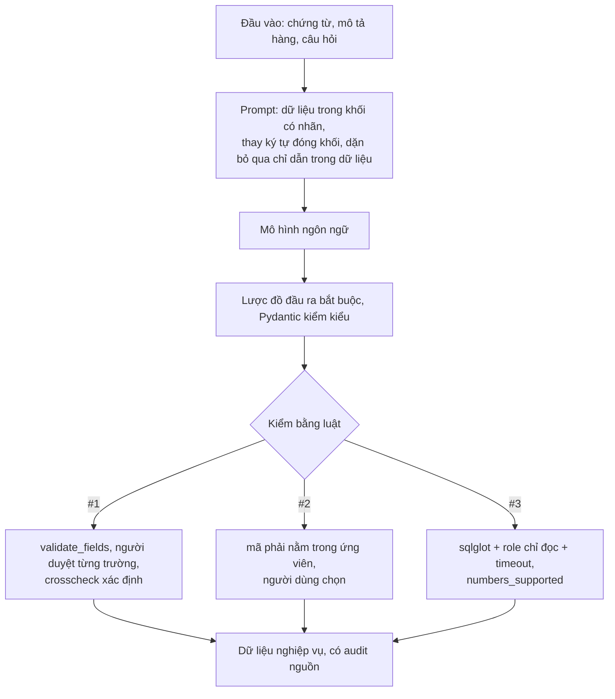
```mermaid
flowchart TB
    IN[Đầu vào: chứng từ, mô tả hàng, câu hỏi] --> P[Prompt: dữ liệu trong khối có nhãn,<br/>thay ký tự đóng khối, dặn bỏ qua chỉ dẫn trong dữ liệu]
    P --> M[Mô hình ngôn ngữ]
    M --> S[Lược đồ đầu ra bắt buộc, Pydantic kiểm kiểu]
    S --> R{Kiểm bằng luật}
    R -->|#1| R1[validate_fields, người duyệt từng trường,<br/>crosscheck xác định]
    R -->|#2| R2[mã phải nằm trong ứng viên,<br/>người dùng chọn]
    R -->|#3| R3[sqlglot + role chỉ đọc + timeout,<br/>numbers_supported]
    R1 --> OUT[Dữ liệu nghiệp vụ, có audit nguồn]
    R2 --> OUT
    R3 --> OUT
```

*Hình 3.12. Các lớp kiểm giữa mô hình ngôn ngữ và dữ liệu nghiệp vụ*

Chèn lệnh (prompt injection) được giảm thiểu ở prompt và chặn ở phía sau: dù mô hình bị lái, mã HS ngoài ứng viên bị loại, SQL sai luật bị từ chối và role không có quyền ghi, số không khớp thì câu trả lời không hiện, và AI #1 không ghi gì khi chưa có người duyệt. Chữ do mô hình sinh luôn được render dạng văn bản thuần trên giao diện (không HTML, không Markdown ảnh hay liên kết); kiểm thử đầu-cuối chèn `` vào mô tả hàng và câu hỏi để xác nhận không thực thi. Mọi nơi gửi dữ liệu ra ngoài đều hiện tên dịch vụ nhận (Anthropic hoặc Google) và lời nhắc chỉ dùng dữ liệu mô phỏng khi dùng gói miễn phí của Gemini, vì gói này cho phép nhà cung cấp dùng dữ liệu gửi lên. `LLM_MODE=replay` cho bộ kiểm thử chạy mà không gửi gì ra ngoài.

### 3.7.6 Header tại cổng vào

Caddy đặt `Strict-Transport-Security`, `X-Content-Type-Options: nosniff`, `Referrer-Policy: same-origin`, xoá header `Server`, và Content-Security-Policy với `default-src 'self'`, `img-src 'self' data: blob:`, `connect-src 'self'`, `object-src 'none'`, `frame-ancestors 'none'`, `base-uri 'self'`, `form-action 'self'`. Tài liệu OpenAPI (`/docs`, `/openapi.json`) chỉ mở khi `APP_ENV` khác `prod`. Bản hiện tại còn cho `script-src 'unsafe-inline'` (và `'unsafe-eval'` ở môi trường dev); CSP dùng nonce theo từng yêu cầu là phần việc đi kèm cấu hình triển khai thật ở mục 3.2.2. Biên bản rà soát bảo mật (Task 14.3) ghi nhận đây là phát hiện mức trung bình, ảnh hưởng thực tế thấp vì React thoát ký tự và mã nguồn không dùng `dangerouslySetInnerHTML`.

## 3.8 Giao diện

Giao diện back-office theo hướng "bàn điều khiển chứng từ": danh sách lô có bộ lọc trên URL để chia sẻ được đường dẫn, chi tiết lô chia tab và có cột phải "việc cần làm tiếp theo", bảng dữ liệu dùng chung (hàng 40 px, phân trang 50 dòng), trạng thái luôn có biểu tượng, chữ và màu. Các ảnh dưới đây chụp trên môi trường phát triển với dữ liệu mô phỏng sinh bằng `seed_demo --seed 1 --size full` (200 lô, 500 container, 2.000 đơn giao), ngày tham chiếu 29/09/2026; kích thước 1280×800 với máy tính và Pixel 7 với điện thoại.

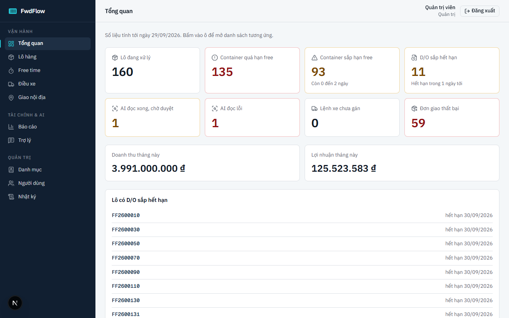

*Hình 3.13. Dashboard (Quản trị viên): lô đang xử lý, container quá hạn và sắp hạn free time, D/O sắp hết hạn, việc AI chờ duyệt, đơn giao thất bại; doanh thu và lợi nhuận chỉ hiện với Admin và Kế toán*

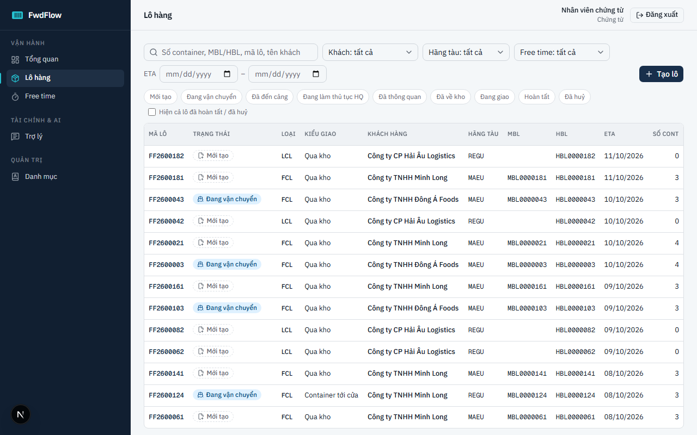

*Hình 3.14. Danh sách lô hàng (Nhân viên chứng từ) với bộ lọc theo khách, hãng tàu, mức free time, ETA và các chip trạng thái*

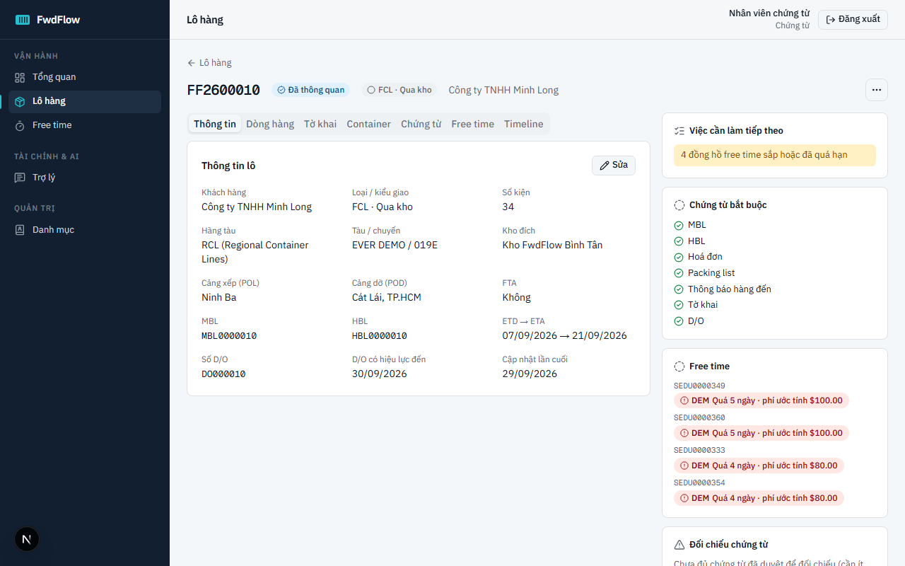

*Hình 3.15. Chi tiết lô `FF2600010`: các tab thông tin, dòng hàng, tờ khai, container, chứng từ, free time, timeline; cột phải liệt kê việc cần làm, checklist chứng từ bắt buộc và bốn đồng hồ DEM đã quá hạn kèm phí ước tính*

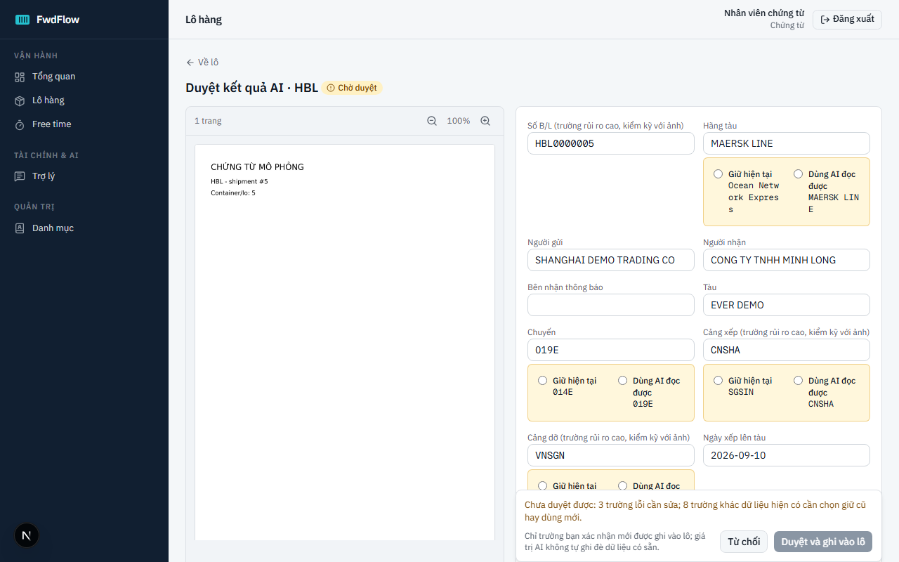

*Hình 3.16. Màn duyệt kết quả AI đọc HBL: ảnh chứng từ bên trái, biểu mẫu bên phải; trường đã có giá trị trong lô bắt buộc chọn "giữ hiện tại" hoặc "dùng AI đọc được"; trường rủi ro cao được nhắc kiểm kỹ với ảnh; nút duyệt chỉ bật khi không còn trường lỗi*

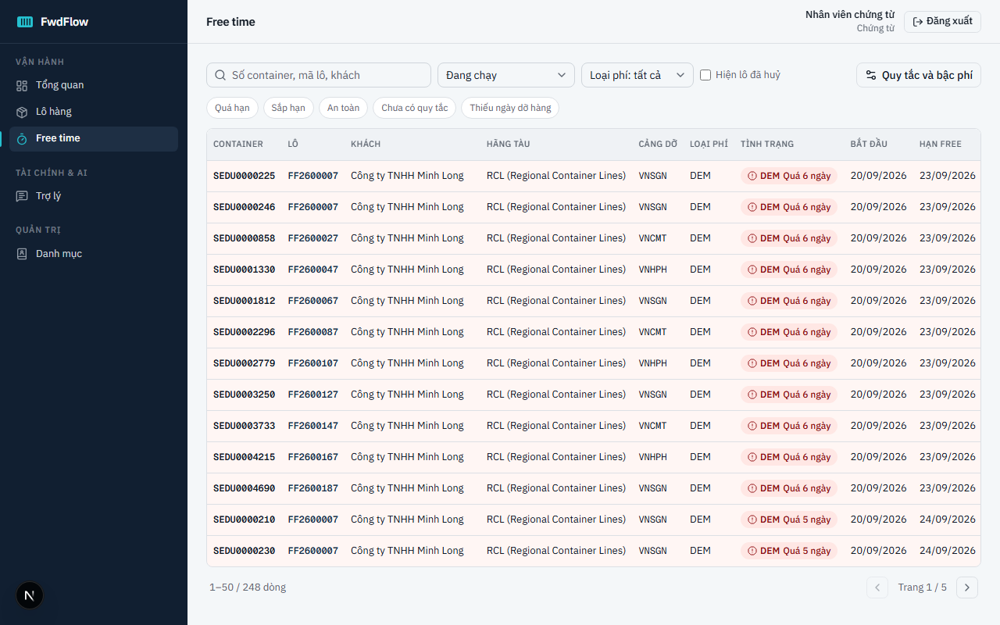

*Hình 3.17. Bảng free time: mỗi dòng một đồng hồ của một container, lọc theo trạng thái đang chạy, loại phí, mức cảnh báo; liên kết tới trang quy tắc và bậc phí*

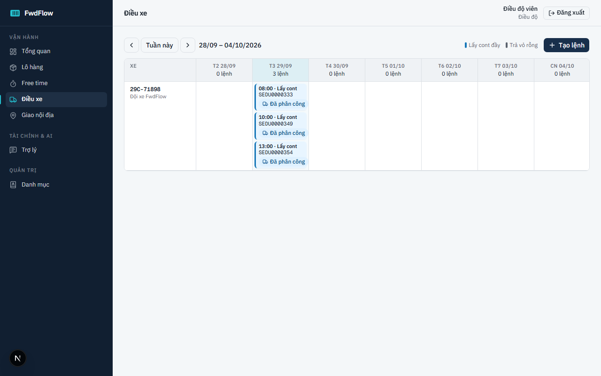

*Hình 3.18. Lịch tuần điều xe (Điều độ viên): mỗi hàng một xe, mỗi ô một lệnh lấy container đầy hoặc trả vỏ rỗng với trạng thái*

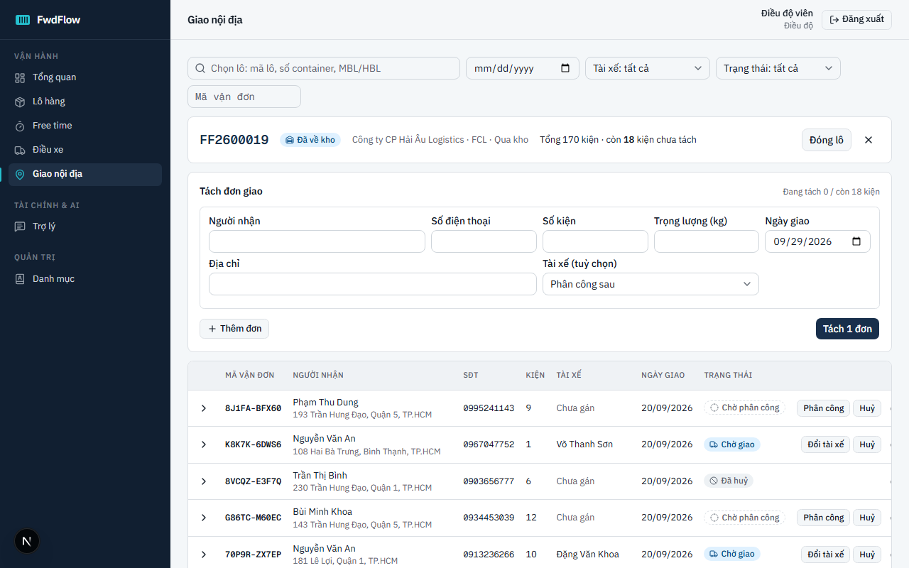

*Hình 3.19. Giao nội địa: chọn lô đã về kho, tách đơn từ quỹ kiện còn lại (còn 18 kiện chưa tách), phân công tài xế, huỷ hoặc đổi tài xế, đóng lô*

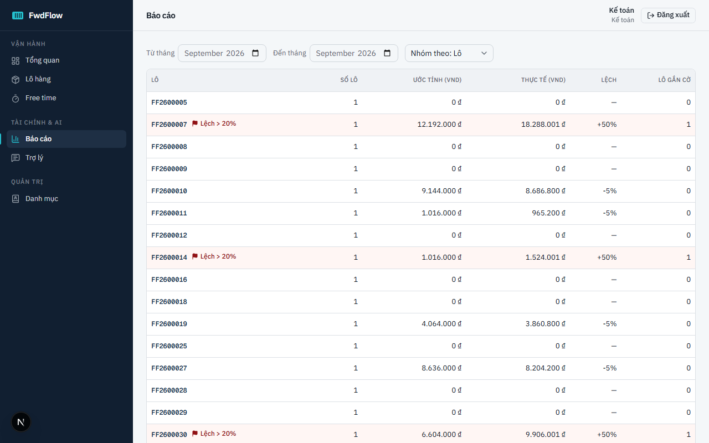

*Hình 3.20. Báo cáo DEM/DET (Kế toán): phí ước tính từ đồng hồ free time so với chi phí thực tế đã nhập, gắn cờ lô lệch quá 20 %*

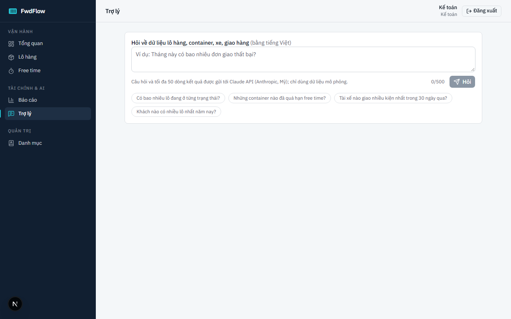

*Hình 3.21. Trợ lý hỏi đáp dữ liệu: ô câu hỏi tiếng Việt, câu hỏi mẫu, dòng cảnh báo về dịch vụ nhận dữ liệu và giới hạn 50 dòng gửi đi*

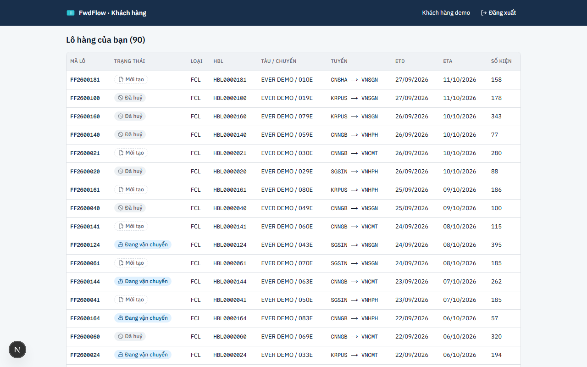

*Hình 3.22. Cổng khách hàng: chỉ lô của chính khách, không có khung back-office*

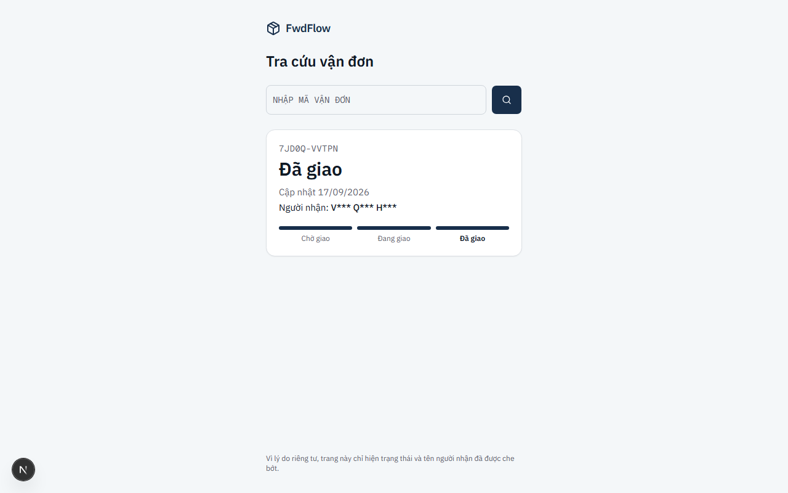

*Hình 3.23. Trang tra cứu công khai `/track/{code}`: trạng thái, ngày cập nhật, tên người nhận đã che; không đăng nhập*

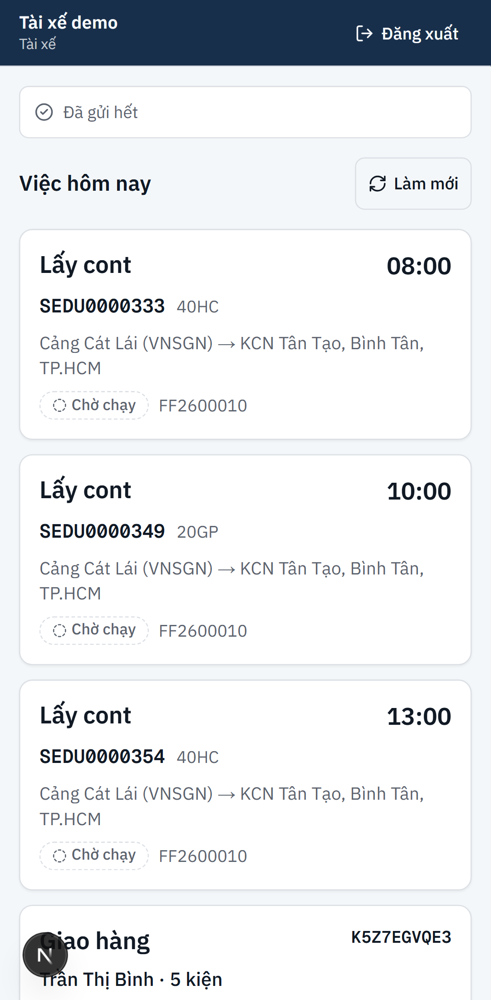

*Hình 3.24. App tài xế trên điện thoại (trình duyệt giả lập Pixel 7): thanh trạng thái hàng chờ gửi ("Đã gửi hết"), việc hôm nay gồm ba lệnh lấy container và các đơn giao; bấm vào từng việc để thao tác kèm ảnh và vị trí*

Ứng dụng tài xế lưu mỗi thao tác cùng ảnh đã nén phía client vào IndexedDB trước khi gửi, hiện số việc chưa gửi trên thanh trạng thái và gửi lại tự động khi có mạng; vì server bỏ qua thao tác trùng theo `client_request_id`, ứng dụng gửi lại vô điều kiện mà không sợ ghi hai lần. Trang tra cứu và cổng khách hàng nằm ngoài khung back-office và không nhận sidebar; tra cứu gọi API từ trình duyệt để HTML trả về không chứa dữ liệu vận đơn.

## 3.9 Tóm tắt chương

Chương này đã trình bày thiết kế của FwdFlow: sáu vai trò với bảng quyền 26 hành động làm nguồn duy nhất cho cả mã lẫn kiểm thử; kiến trúc ba tầng sau một cổng vào; mô hình dữ liệu lấy event append-only làm sự thật gốc và coi mọi trạng thái, hạn, phí là dữ liệu suy ra; bốn máy trạng thái với các cạnh tự động được bảo vệ bằng khoá theo lô; free time tính bằng một hàm SQL dùng chung cho API, email và trợ lý; ba tính năng AI được bọc bởi kiểm tra xác định và quyết định của người dùng; và các lớp bảo mật từ phiên, CSRF, phân quyền, audit, file tải lên tới role chỉ đọc cho SQL do AI sinh. Chương 4 sẽ trình bày cách đánh giá và kết quả thực nghiệm của ba tính năng AI cùng bộ kiểm thử của hệ thống.
